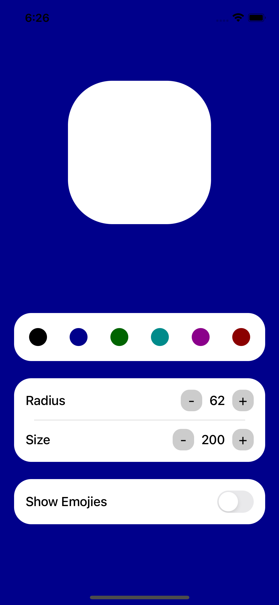

# React Native Dynamic App

This is a React Native app inspired by the design concept on Dribbble titled ["Say Hello to Figma's latest features - advanced prototyping"](https://dribbble.com/shots/21813851-Say-Hello-to-Figma-s-latest-features-advanced-prototyping). The app allows users to create dynamic components with adjustable height and width, along with the ability to select and display emojis. The animations are implemented using React Native Reanimated.

## Features

- Adjust the height and width of component dynamically
- Select and display emojis within the components
- Smooth animations powered by React Native Reanimated

## Screenshots

[Demo Video](./images/SimulatorScreenRecording.mp4)

  
  
  

## Installation

Follow these steps to run the app locally:

1. Clone the repository: `git clone https://github.com/iamsrikanthnani/DynamicReactNative.git`
2. Navigate to the project directory: `cd DynamicReactNative`
3. Install the dependencies: `npm install` or `yarn install`
4. Install the native dependencies (iOS only): `cd ios && pod install && cd ..`
5. Run the app on a connected simulator or device: `yarn run android` or `yarn run ios`
6. Start the Metro server: `npm start` or `yarn start`

Make sure you have the necessary development environment set up for React Native.

## Dependencies

The app utilizes the following dependencies:

- React Native: 0.72.0
- React Native Reanimated: 3.3.0
- Styled Components: 6.0.0

For detailed information about other dependencies, please refer to the package.json file.

## Contribution

Contributions to this project are welcome! If you have any ideas, improvements, or bug fixes, please submit a pull request. For major changes, please open an issue first to discuss the proposed changes.

## License

This project is licensed under the [MIT License](LICENSE).
